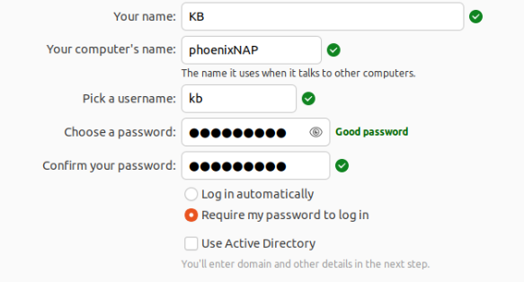
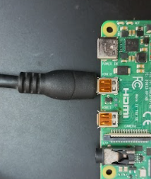
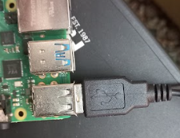
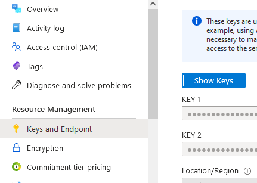

# Raspberry Pi Live Closed Captioning with Azure Cognitive Services


This repo contains two projects, both supporting the Raspberry Pi and desktop platforms via .NET 6: 
- AzureSpeechCC: This project uses Microsoft Azure Cognitive Services speech recognition to generate real-time captions.
- AzureTranslateCC: This project uses Microsoft Azure Cognitive Services speech recognition and translation to generate real-time translations.

https://user-images.githubusercontent.com/46184494/172901241-2b21438e-2600-4397-a6b6-4cd5b5c7c63d.mp4

Speech is captured via a USB microphone and, using .NET 6, calls Azure Cognitive Services speech-to-text service, which then displays recognized (or translated) text in real-time captions to an LCD screen. You can also generate captions on [a remote screen via SSH](https://github.com/microsoft/rpi-resources). 

***Privacy Note: This project does NOT store captions.** If you use this to generate in-person captions, please be sure to inform all speakers that they are being transcribed but not recorded.*


**You can sign up for a [free 30-day trial of Azure](https://aka.ms/azure/live-captions) w/ $200 in credits to test out this project.*

**Read Time**: 10 min

**Build Time**: 20 min (excluding installation times)

**Speech-to-text Cost**:
   * **Free Tier** (1 concurrent request): 5 free audio hours per month
   * **Standard Tier** (100 concurrent requests): $1 per audio hour
   * Check the [Azure pricing page](https://azure.microsoft.com/en-us/pricing/details/cognitive-services/speech-services/) for details on paid tiers.

**Translation Cost**:
   * **Free Tier** 2M chars of any combination of standard translation and custom training free per month
   * Check the [Azure pricing page](https://azure.microsoft.com/en-us/pricing/details/cognitive-services/translator/) for details on paid tiers.

[More info on cost here.](https://aka.ms/azure/live-caption/cost)

**Many thanks** to the original developer of this open source project: [Mohsin Ali](https://www.linkedin.com/in/mmohsinali)! You can see Mohsin's other GitHub projects here: [m-mohsin-ali (M Mohsin Ali)](https://github.com/m-mohsin-ali)

## Contents

## Hardware Requirements
1. [Raspberry Pi](https://thepihut.com/collections/featured-products/products/raspberry-pi-4-model-b) 
   : We will be using the 4GB version.
   1. [5V power supply](https://thepihut.com/products/raspberry-pi-psu-uk)
   2. [Micro SD card](https://thepihut.com/products/sandisk-microsd-card-class-10-a1)
   3. [MicroSD Card Reader](https://thepihut.com/products/mini-usb-2-0-microsd-card-reader)
2. [Microphone Usb plug n play](https://thepihut.com/products/mini-usb-microphone)
   : Any USB plug and play device works.
3. [Lcd Screen](https://thepihut.com/products/7-capacitive-touchscreen-lcd-low-power-800x480)
   : We are using this for rich text quality. You can use any other compatible displays.
   : You may also skip the screen and access the Pi via SSH.
4. [Pair of Keyboard and Mouse](https://www.amazon.eg/-/en/HP-CS700-Wireless-Keyboard-Mouse/dp/B07M82KFVB)
   : A basic keyboard and mouse for using as input devices with the Raspberry Pi.
   
## Raspberry Pi Setup
### Download Operating System
Note: We recommend using the Ubuntu 22 64 bit OS because it has better support for the architecture we're using. However, Raspberry Pi OS will work for this project.


   1. On your desktop computer, download and install [Raspberry Pi Imager](https://www.raspberrypi.com/software/).
   1. Run Raspberry Pi Imager. The home screen will appear.
   1. Select '**CHOOSE STORAGE**'
   1. Insert the microSD card into your computer (or via a card reader).
   1. Select the connected microSD card as your storage device.

      
   
   1. On the home streen, select '**CHOOSE OS**'. 
   7. Select in this order: '**Other general-purpose OS**' > '**Ubuntu**' > '**Ubuntu Desktop 22.04 LTS (RPi 4/400)**'

      
   *Note: Although Raspbian does come in a 64bit version, Ubuntu has better support for the architecture and available software.*

   1. On the home screen, select 'WRITE'.
   1. A loading bar will appear.

      


      *Note: Flashing the SD Card may take a few minutes to an hour to complete.*

   1. Safely eject the SD card and insert it into the Raspberry Pi.
   1. If you're connecting directly to the Pi, connect the display, keyboard, and mouse.
   1. Finally, connect the power supply!
   1. Once the Pi boots up, configure your WiFi settings, keyboard layout and timezone.
   1. CHANGE YOUR PASSWORD. This is important because otherwise someone could get access to your Pi and make your closed captions come out all silly.
      


   1. Safely eject the SD card and insert into the Raspberry Pi. 
      


### Raspberry Pi Physical Setup 
This section covers how to connect peripheral devices, like a screen, keyboard, and mouse, to our Raspberry Pi.

   1. If you're using a screen, connect the display via USB and HDMI ports.

      
      
      

   1. Connect Micro-USB (Display) to USB (RaspberryPi)

      

      

   1. Connect the  USB Mic to a Pi USB port.
      
      

      

   1. Connect the keyboard and mouse. We're using a wireless dongle for both keyboard and mouse.

      

   1. Finally, connect the power supply! 

      


### Software Updates and Installs
This section shows you how to install dependencies for the project onto your Raspberry Pi.

**Follow these steps on your Raspberry Pi computer.**

   1. Open the terminal.
   1. Make a directory to store our project by running the following commands:
      ```bash
      mkdir live-captioning
      cd live-captioning
      ```
   1. Setup the .NET Framework by running the following commands:
      ```bash
      curl -sSL https://dot.net/v1/dotnet-install.sh | bash /dev/stdin --channel Current
      ```
   1. Once the files are installed, set the environment variables by running the following commands:
      ```bash
      echo 'export DOTNET_ROOT=$HOME/.dotnet' >> ~/.bashrc
      echo 'export PATH=$PATH:$HOME/.dotnet' >> ~/.bashrc
      source ~/.bashrc
      ```
   1. Verify the installation
      ```bash
      dotnet --version
      ```
   1. Finally, install the Azure Cognitive Services speech-to-text dependencies with the following commands: 

      ```bash
      sudo apt-get update
      sudo apt-get install build-essential libssl-dev libasound2 wget 
      ```

   * We need to manually install the libssl1.0.0 as its not available for ubuntu 22. Run the following command:
      ```bash
      wget http://ftp.us.debian.org/debian/pool/main/o/openssl/libssl1.1_1.1.1n-0+deb11u1_arm64.deb
      ```
   * Next, install from file:
      ```bash
      sudo apt install -f ./libssl1.1_1.1.1n-0+deb11u1_arm64.deb
      ```
## Set up Azure Cognitive Services 
Now it's time to sign up for Azure Cognitive Services and get our API keys! 

**Follow these steps on your desktop or laptop computer.**

   1. Sign up for [a free Azure account here](https://aka.ms/azure/live-captions). Your free trial lasts 30 days and includes $200 Azure credits.

      

   1. Once you're logged in to your Azure dashboard, select 'Create a Resource'.

      
   
   1. Select (or search for) Cognitive Services.

   1. Create a new speech service.
      

   1. From here, you will need the keys and the region to set up speech-to-text on the Raspberry Pi.
 
      
   1. Copy one of the keys (any of them will work) and the location region.

## Run the Project!
The following section shows you how to run the project on your Raspberry Pi. **Follow these steps on your Raspberry Pi computer.**

   1. If you don't already have it, install git with the following command:

      ```bash
      sudo apt install git
      ```

   1. Navigate to the project folder that we created earlier:
      ```bash
      cd live-captioning
      ```
   1. Clone this repository: 
      ```bash
      git clone https://github.com/jenfoxbot/closed-captioning-azure-speech-ai
      ```
   1. Navigate to the repository folder that contains project code: 
      ```bash
      cd closed-captioning-azure-speech-ai/code/AzureSpeechCC
      ```
      OR
      ```bash
      cd closed-captioning-azure-speech-ai/code/AzureTranslateCC
      ```

   1. Add your Cognitive Services keys to the code:
      ```bash
      nano Program.cs
      ```
      ```C#
      class Program
         {

            static string YourSubscriptionKey = "Enter your Key Here";
            static string YourServiceRegion = "Enter your Region here";
      ...
      ```
   1. Press CTRL+X and save/overwrite the file.

   1. Add the Azure Speech SDK lib/package to the code directory by running the following:
      ```bash
      dotnet add package Microsoft.CognitiveServices.Speech
      ```
   1. We did it!! Let's run the code and see our wizardry in action:
      ```bash
      dotnet build
      dotnet run
      ```
      * *Note: Once you've built, you can run the program with only this command: 
      ```bash
      dotnet run
      ```
Test out different audio sources, try different sounds and voices, and explore the capabilities and limits of the live speech-to-text translation!

## Going Further
   - Make the project portable by getting an enclosure for the Pi, a small touch screen, and a USB-C battery.
   
**Show us your creations by tagging us on Twitter, @MakersAtMicrosoft, or using the hashtag #AzureLiveCaptions!**
